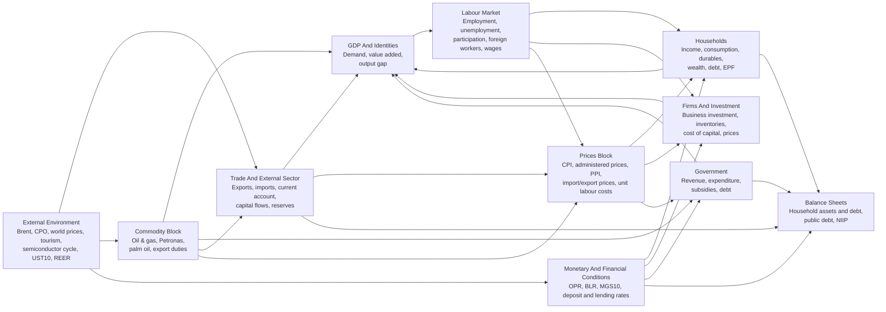

# Model Architecture

This page gives a clean high-level map of the system in [model/malaysia-quarterly-model.md](../model/malaysia-quarterly-model.md).

## Diagram

## Reading Guide

- Start with households, firms, government, and trade.
- Then read prices, labour, and commodities as the main transmission layers.
- Treat balance sheets and debt dynamics as the stock-flow discipline around the core demand system.
- Treat some external wedges as governed inputs rather than fully endogenous outputs.

## Scope Note

This is an architecture diagram, not a causal proof. Several links are reduced-form and some important drivers remain exogenous in the current version of the model.
